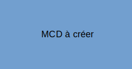

# Nom de la présentation ou du projet à définir  

## Description  
Petite description + MCD du projet  



## Installation  
```bash
$ git clone https://github.com/Equinoz/presentation_nestjs.git
$ cd presentation_nestjs
```
Puis renseigner les fichiers `env/postgres.env` et `env/server.env`  

## Lancer le serveur et le SGBD via docker  
```bash
docker-compose up -d
```
Le projet est accessible à l'adresse `http://localhost:3000`  